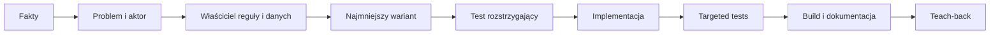

# AI-assisted development workflow

## Cel

Ten workflow ma przyspieszać pracę nad starterem bez zastępowania rozumienia domeny,
failure paths i granic modułów. Domyślną jednostką pracy jest jeden spójny vertical
slice.

## Tryby pracy

| Tryb | Wynik |
| --- | --- |
| `PLAN ONLY` | Analiza faktów, wariantów, ryzyk i testu rozstrzygającego bez edycji kodu. |
| `IMPLEMENT` | Mała implementacja wraz z testami, buildem i dokumentacją. |
| `REVIEW` | Ocena aktualnego diffu bez rozszerzania zakresu. |
| `DEBUG` | Reprodukcja, hipoteza, minimalna poprawka i test regresji. |
| `TEACH-BACK` | Użytkownik własnymi słowami odtwarza przepływ i przypadki błędów. |

Jeśli tryb nie został podany, prośba o zmianę oznacza `IMPLEMENT`, a prośba o ocenę
lub plan oznacza `PLAN ONLY` albo `REVIEW`.

## Pętla jednego slice'a

### 1. Zbierz minimalne fakty

Przeczytaj:

- najbliższy istniejący command albo query slice;
- modułowy entry point DI;
- test publicznego kontraktu;
- dokument granicy lub ADR, jeśli zmiana jej dotyka.

Nie wykonuj pełnego audytu repozytorium, jeśli te źródła rozstrzygają problem.

### 2. Zdefiniuj zachowanie

Ustal:

- aktora i oczekiwany rezultat;
- sukces oraz meaningful failure paths;
- uprawnienia;
- niezmienniki;
- właściciela danych i reguły;
- granicę transakcji i zachowanie concurrency;
- elementy poza zakresem.

Dla większego feature'a użyj
[`FEATURE_PROPOSAL_TEMPLATE.md`](PRODUCT_EVOLUTION/FEATURE_PROPOSAL_TEMPLATE.md).

### 3. Porównaj maksymalnie kilka wariantów

Preferuj najmniejszy wariant zgodny z obecną architekturą. Nowa biblioteka,
abstrakcja albo proces są uzasadnione dopiero wtedy, gdy obecny wzorzec nie spełnia
konkretnego wymagania.

### 4. Zdefiniuj test rozstrzygający

Najpierw wybierz najtańszy test, który może wykazać, że decyzja jest błędna. Następnie
dobierz pozostałe testy proporcjonalnie do ryzyka:

- unit dla reguły lub handlera;
- integration dla publicznej trasy;
- PostgreSQL dla transakcji, constraintu i concurrency;
- frontend test dla stanu UI;
- browser E2E dla krytycznego przepływu użytkownika.

### 5. Implementuj małym checkpointem

Korzystaj z golden path w [`ADDING_FEATURES.md`](ADDING_FEATURES.md). Nie twórz
elementów niedotyczących slice'a tylko po to, aby wszystkie katalogi wyglądały tak
samo.

### 6. Zweryfikuj

Minimalna kolejność:

1. targeted test dla zmienionego zachowania;
2. build dotkniętej części;
3. szerszy zestaw testów, jeśli zmienił się kontrakt, DI, routing, persistence albo
   granica modułu;
4. [`MODULAR_VSA_MODULE_CHECKLIST.md`](MODULAR_VSA_MODULE_CHECKLIST.md);
5. aktualizacja dokumentacji i ADR-u, jeśli decyzja ma długotrwały wpływ.

## Podział odpowiedzialności

AI może przygotować boilerplate, powtarzalne mapowanie, dokumentację i pierwszą
wersję testów. Właściciel projektu powinien umieć samodzielnie wyjaśnić:

- dlaczego feature należy do wybranego modułu;
- gdzie jest chroniony każdy niezmiennik;
- dlaczego transakcja kończy się w danym miejscu;
- co zwraca API przy braku uprawnień, konflikcie i częściowej awarii;
- który test wykrywa najważniejszą regresję.

Orientacyjny model współpracy to 80% delivery i 20% training. Nie jest to metryka
liczby linii kodu.

## Teach-back po zmianie

Po zakończeniu użytkownik powinien odpowiedzieć:

1. Jaki problem rozwiązuje slice i kto jest jego aktorem?
2. Który moduł jest właścicielem danych oraz reguły?
3. Co jest atomowe i gdzie następuje commit?
4. Jak zachowuje się system przy braku uprawnień, retry i concurrency?
5. Który test najszybciej wykryje regresję?

Plan kolejnych inkrementów znajduje się w
[`PRODUCT_EVOLUTION/DEVELOPMENT_PLAN.md`](PRODUCT_EVOLUTION/DEVELOPMENT_PLAN.md).
