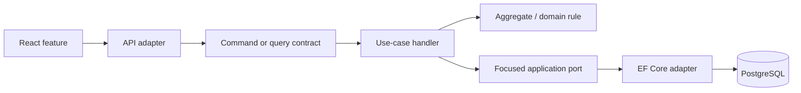

# Plan rozwoju produktu i startera

## Status dokumentu

- Data decyzji: **2026-09-21**.
- Zakres: rozwój funkcji, ergonomia Vertical Slice Architecture i późniejsza
  reużywalność startera.
- Źródła: aktualny branch V5, niezakomitowane dokumenty w tym katalogu,
  [`PROJECT_FACTS_SNAPSHOT.md`](PROJECT_FACTS_SNAPSHOT.md), kanoniczna
  [`roadmapa`](../ROADMAP/00_ROADMAP_OVERVIEW.md) oraz przekazany snapshot operacyjny
  ProcureFlow.
- Ten dokument ustala kolejność pracy. Nie zastępuje kart funkcji ani ADR-ów.

## Ocena obecnego kierunku

Kierunek jest poprawny: należy zachować hybrydowy modularny monolit, jedną aplikację,
jedną bazę PostgreSQL i vertical slices wewnątrz modułów biznesowych. Projekty
`Projects`, `ProjectTasks` i `Notifications` potwierdziły już granice VSA niezależnie
od biblioteki dispatchingu. Następnym zaakceptowanym krokiem edukacyjnym i
architektonicznym jest inkrementalna adopcja MediatR bez generycznego repozytorium,
osobnych baz i masowego przepisywania rozwiązania.

Największym problemem nie jest dziś brak kolejnej warstwy architektonicznej. Problemem
jest koszt poznawczy dodania kompletnego feature'a:

- jeden slice jest rozłożony między `Application`, `API`, `Infrastructure` i testy;
- część rejestracji DI jest ręczna;
- kilka dokumentów roadmapy opisuje stan sprzed implementacji V4/V5;
- backlog miesza funkcje już zaimplementowane z rzeczywiście nowymi kandydatami;
- brakowało jednego krótkiego golden path od pomysłu do zwalidowanego slice'a.

Nie należy rozwiązywać tego teraz własnym frameworkiem albo generatorem. Najpierw
trzeba uprościć instrukcję, zastosować ją w kolejnych rzeczywistych feature'ach i
zmierzyć powtarzalny koszt.

## Decyzja architektoniczna

Pozostaje obowiązujący model z
[`ADR incremental modular VSA`](../ROADMAP/11_ADR_INCREMENTAL_MODULAR_VSA.md):



Reguły upraszczające:

1. Moduł jest wybierany na podstawie właściciela reguły i danych, nie nazwy ekranu.
2. Slice reprezentuje jeden rezultat użytkownika i jest command albo query.
3. Tworzymy tylko elementy potrzebne danemu przypadkowi użycia. Query bez inputu
   domenowego nie potrzebuje sztucznego agregatu, eventu ani workera.
4. Handler koordynuje przypadek użycia, agregat chroni niezmienniki, baza chroni
   reguły wymagające odporności na współbieżność.
5. Zależność do innego modułu przechodzi przez jawny port i ma jednego właściciela.
6. Jeden moduł ma jeden jawny entry point DI. MediatR odpowiada za in-process
   dispatch command/query, ale nie zastępuje granicy modułu ani focused ports.
7. Publiczny kontrakt, autoryzacja, błędy, test i dokumentacja są częścią slice'a,
   a nie zadaniami „na później”.

Szczegółową decyzję i kolejność migracji opisuje
[`ADR incremental MediatR adoption`](../ROADMAP/14_ADR_INCREMENTAL_MEDIATR_ADOPTION.md).

## Model realizacji: trzy równoległe tory

| Tor | Cel | Reguła kolejności |
| --- | --- | --- |
| Produkt i VSA | Dostarczać małe funkcje oraz wdrożyć MediatR bez naruszenia granic slice'a. | Jeden spójny use case lub jeden krok migracji na branch. |
| Dowody operacyjne V5 | Potwierdzić staging, backup off-host, restore drill, rollback i alerty. | Nie blokuje lokalnej pracy produktowej, ale blokuje deklarację production-ready. |
| Platformizacja V8 | Automatyzować wyłącznie wzorce potwierdzone i zmierzone w kilku modułach. | Generator dopiero po zebraniu kosztu ręcznego workflowu. |

Etapy V3-V8 pozostają mapą dojrzałości, ale nie powinny działać jak jedna długa kolejka,
w której brak zewnętrznego VPS blokuje lokalny feature.

## Plan inkrementów

### M0: spójna dokumentacja i golden path VSA

**Cel:** jedna odpowiedź na pytanie „jak dodać feature?”.

Zakres:

- zsynchronizować statusy roadmapy z aktualnym snapshotem;
- używać [`ADDING_FEATURES.md`](../ADDING_FEATURES.md) jako instrukcji wykonawczej;
- używać [`FEATURE_PROPOSAL_TEMPLATE.md`](FEATURE_PROPOSAL_TEMPLATE.md) przed większym
  slice'em;
- utrzymać [`MODULAR_VSA_MODULE_CHECKLIST.md`](../MODULAR_VSA_MODULE_CHECKLIST.md)
  jako Definition of Done;
- wskazywać istniejące command/query slices jako wzorce zamiast tworzyć abstrakcyjny
  przykład.

**Test rozstrzygający:** osoba znająca podstawy rozwiązania potrafi wskazać właściciela
modułu, utworzyć szkielet query slice'a i znaleźć wszystkie obowiązkowe testy bez
repozytory-wide refaktoryzacji.

### M1: domknięcie kontraktu Notifications

**Problem:** backend zna więcej typów powiadomień niż frontend, więc utrzymanie nowych
zdarzeń grozi niepełnym UI, błędnym linkowaniem albo pominięciem testu.

Najmniejszy zakres:

- ustalić kanoniczny katalog typów i wymaganych pól;
- wyrównać kontrakty backendu i TypeScript;
- zdefiniować bezpieczne zachowanie dla nieznanego typu;
- domknąć linkowanie do zasobu;
- dodać test kontraktu oraz jeden browser E2E dla zdarzenia obecnie nieobsługiwanego
  przez frontend.

**Właściciel:** moduł `Notifications`; moduły źródłowe tylko zapisują zdarzenie przez
jawny port w swojej transakcji.

**Test rozstrzygający:** każdy publiczny typ backendowy ma obsługę frontendową, a
powiadomienie innego użytkownika nie jest widoczne ani możliwe do oznaczenia jako
przeczytane.

Poza zakresem: SignalR/SSE, broker wiadomości i exactly-once delivery.

### M2: MediatR dla modularnego VSA

**Cel:** wdrożyć workplace-relevant dispatch command/query i pipeline behavior bez
zmiany publicznego API, modelu domenowego ani granic modułów.

Zakres:

1. przed zmianą manifestów sprawdzić stabilną wersję, licencję, wymagania runtime i
   zależności pakietu;
2. zarejestrować MediatR jeden raz przez jawne rozszerzenie backendowego dispatchu;
3. przenieść query `Projects/GetProjectDetails` na `IRequest<TResult>`,
   `IRequestHandler<TRequest, TResult>` i `ISender`;
4. przenieść command `ProjectTasks/CreateProjectTask` tą samą ścieżką;
5. dodać bezpieczny pipeline behavior mierzący typ requestu, czas,
   sukces/anulowanie/wyjątek i correlation context bez logowania payloadu;
6. rozszerzyć testy architektoniczne o dokładnie jeden handler per request, DI,
   zależność `Domain` i propagację cancellation tokenu;
7. po przejściu bramki używać MediatR w nowych slice'ach i migrować istniejące
   moduły w kolejności `Notifications`, `Projects`, `ProjectTasks`;
8. migrować `Identity` tylko przy realnej zmianie konkretnego use case'a.

Autoryzacja zasobowa, transakcja, finalny `SaveChangesAsync`, optimistic concurrency
i trwały notification/outbox pozostają jawne. Pierwszy etap nie dodaje globalnego
transaction behavior, validation behavior, retry ani `MediatR.INotification`.

**Test rozstrzygający:** oba slice'y zachowują identyczne trasy, response/status codes
i skutki w bazie, a test architektury wykrywa brak albo duplikat handlera.

**Bramka adopcji:** decyzja o użyciu MediatR jest zaakceptowana. Pilot rozstrzyga
szczegóły rejestracji, telemetrii i tempo migracji, a nie to, czy biblioteka zostanie
natychmiast usunięta po demonstracji.

### M3: jawna macierz uprawnień

**Problem:** wraz z kolejnymi workflowami warunki `Owner`/`Member`/`Viewer` mogą zacząć
różnić się między slice'ami.

Najmniejszy zakres:

- opisać macierz obecnych operacji;
- wybrać jeden powtarzający się warunek i nadać mu jednoznacznego właściciela;
- dodać testy anonymous, forbidden, not-found masking i zmianę roli;
- zachować frontendowy gating wyłącznie jako UX.

**Test rozstrzygający:** zmiana roli natychmiast wpływa na dostęp do zasobu, a
identyfikator zasobu spoza dostępnego projektu nie ujawnia jego istnienia.

Poza zakresem: custom roles, pełny policy engine i multi-tenancy.

### M4: trwałe powiadomienia z opcjonalnym real-time

**Warunek wejścia:** M1 i autoryzacyjna część M3 są zakończone.

Najmniejszy zakres:

- krótki ADR porównujący SignalR i SSE dla jednostronnej dostawy;
- baza i endpoint listy pozostają źródłem prawdy;
- transport push tylko informuje klienta o zmianie;
- reconnect wykonuje synchronizację z API;
- deduplikacja używa trwałego `NotificationId`;
- metryki połączeń, reconnectów i błędów.

**Test rozstrzygający:** klient offline odzyskuje powiadomienie po reconnect, a drugi
użytkownik nie otrzymuje zdarzenia.

Poza zakresem: Kafka, Redis Pub/Sub i skalowanie wieloinstancyjne bez pomiaru.

### M5: jeden rzeczywisty workflow zadania

**Warunek wejścia:** potwierdzony problem użytkownika, na przykład review/approval.

Zakres pierwszego inkrementu obejmuje tylko jedno przejście biznesowe wraz z:

- aktorem i regułą uprawnień;
- metodą domenową oraz dozwolonymi stanami;
- optimistic concurrency;
- activity i notification zapisanymi atomowo ze zmianą;
- jednym API integration testem i jednym browser E2E.

Checklisty, zależności, SLA i wiele rodzajów approval pozostają osobnymi kandydatami.

### M6: punktowa idempotencja i retry

Wybrać jedną operację, dla której timeout lub retry rzeczywiście może utworzyć
duplikat. Najbardziej prawdopodobnymi kandydatami są zaproszenie, upload lub przyszły
webhook. Klucz idempotencji, retencja i odpowiedź dla powtórzenia należą do kontraktu
tego jednego slice'a, nie do każdego endpointu w starterze.

### M7: ergonomia startera i scaffolding

Ten etap zaczyna się dopiero po zmierzeniu co najmniej kilku kolejnych command i query
slices. Kolejność:

1. zebrać czas, liczbę ręcznych kroków i najczęstsze pomyłki;
2. usunąć zbędną ceremonię w istniejącym standardzie;
3. dodać mały generator pojedynczego slice'a;
4. sprawdzić build i test wygenerowanego kodu;
5. dopiero później ocenić `dotnet new`, wybór modułów i aktualizacje wielu projektów.

Generator nie może tworzyć pustych repozytoriów, eventów, workerów ani migracji.

## Kolejność rekomendowana

```text
TERAZ       M0 -> M1
NASTĘPNIE   M2 MediatR -> M3 permission matrix
PÓŹNIEJ     M4 real-time -> M5 task workflow -> M6 reliability
PO DOWODACH M7 scaffolding

RÓWNOLEGLE  V5 staging -> off-host backup -> restore drill -> rollback -> alert test
```

`Saved views` może wejść przed M5 jako mały feature produktowy, jeśli pojawi się
potwierdzona potrzeba. OIDC/SSO, passkeys, multi-tenancy, webhooki i zewnętrzny broker
pozostają odłożone.

## Bramki utrzymywalności każdego feature'a

Feature jest gotowy dopiero, gdy:

- ma jednego właściciela danych i reguł;
- ma jawny command/query oraz wynik błędu;
- po aktywacji bramki MediatR request ma dokładnie jeden handler i jest wysyłany
  przez `ISender`;
- nie omija granicy modułu przez bezpośredni dostęp do cudzego `DbSet`;
- określa transakcję, concurrency i constraint bazy, jeśli są potrzebne;
- aktualizuje kontrakt frontendowy razem z API;
- ma najtańszy test obalający główną hipotezę;
- przechodzi modułową checklistę bez tworzenia elementów oznaczonych jako `N/A`;
- aktualizuje ADR tylko wtedy, gdy zmienia granicę, własność lub długoterminowy
  kontrakt.

## Metryki przed platformizacją

Przy kolejnych slice'ach warto zapisywać:

- czas od pustego katalogu do zielonego testu integracyjnego;
- liczbę ręcznych punktów rejestracji;
- liczbę plików wymaganych dla command i query;
- błędy wykryte przez guardrails architektoniczne;
- czas targeted testów;
- narzut dispatchingu i czas startu po rejestracji MediatR;
- elementy skopiowane mechanicznie bez decyzji biznesowej.

Scaffolding ma sens dopiero wtedy, gdy te dane pokażą powtarzalny koszt. W przeciwnym
razie generator tylko utrwali zbyt ciężki wzorzec.

## Wnioski z ProcureFlow

Przekazany snapshot ProcureFlow potwierdza wartość obecnego V5: immutable obrazy,
kontrolowane migracje, backup obejmujący bazę, obiekty i Data Protection keys,
restore drill, rollback bez down migration oraz obserwowalność są realnymi
kontraktami operacyjnymi.

Dla startera wynikają z tego trzy zasady:

1. Nie kopiować produktu ProcureFlow ani jego nazewnictwa do rdzenia startera.
2. Traktować konfigurację, migracje i dane operacyjne jako część kontraktu modułu.
3. Oddzielić „implementacja istnieje” od „działanie zostało potwierdzone na
   środowisku”; V5 pozostaje nieukończone do zebrania dowodów runtime.
