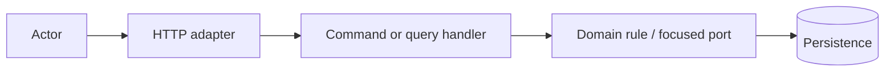

# Feature proposal: CAP-XXX nazwa

## Status

- Stan: `draft`
- Autor:
- Data:
- Powiązany etap roadmapy:
- Powiązany ADR:

Dozwolone stany: `draft`, `proposed`, `accepted`, `implemented`, `rejected`.

## 1. Problem i wartość

**Aktor:**

**Problem:**

**Oczekiwany rezultat użytkownika lub operatora:**

**Dowód, że problem istnieje:**

**Najprostszy wariant bez nowego feature'a i dlaczego nie wystarcza:**

## 2. Zakres

### W zakresie

-

### Poza zakresem

-

## 3. Właściciel i granica modułu

**Moduł będący właścicielem danych:**

**Moduł będący właścicielem reguły:**

**Agregat lub read model:**

**Jawne zależności do innych modułów:**

**Dlaczego ta granica wynika z domeny:**

## 4. Niezmienniki i dane

| Reguła | Właściciel | Ochrona w kodzie | Constraint/transakcja w bazie |
| --- | --- | --- | --- |
|  |  |  |  |

Opisz migrację, backfill i kompatybilność wsteczną albo zaznacz `N/A`.

## 5. Przypadek użycia

- Typ: `command` / `query`
- Nazwa slice'a:
- Stan początkowy:
- Warunek sukcesu:
- Dozwolone przejścia:
- Zachowanie przy równoległej zmianie:



## 6. Autoryzacja

| Aktor/rola | Operacja | Wynik | Uzasadnienie |
| --- | --- | --- | --- |
| Anonymous |  | `401` |  |
| Brak dostępu do zasobu |  | `404` lub `403` |  |
| Viewer |  |  |  |
| Member |  |  |  |
| Owner |  |  |  |

Frontendowy feature gating nie zastępuje autoryzacji serwera.

## 7. Kontrakt HTTP

### Request

```json
{}
```

### Success response

```json
{}
```

### Błędy

| Status | Warunek | Stabilny kod/treść |
| --- | --- | --- |
| `400` |  |  |
| `401` |  |  |
| `403`/`404` |  |  |
| `409` |  |  |

## 8. Spójność i failure paths

- Granica transakcji:
- Operacje wymagające jednego `SaveChangesAsync`:
- Efekty asynchroniczne:
- Retry i idempotencja:
- Zachowanie przy częściowej awarii:
- Źródło prawdy po reconnect/retry:

## 9. Frontend

- Typy i klient API:
- Stan lokalny/współdzielony:
- Loading/empty/error/conflict:
- Dostępność i routing:
- Zachowanie po zmianie uprawnień:

## 10. Test rozstrzygający

**Najtańszy test, który może obalić główną hipotezę:**

Pozostałe testy:

- [ ] reguła domenowa;
- [ ] handler success i meaningful failures;
- [ ] autoryzacja publicznej trasy;
- [ ] persistence/PostgreSQL;
- [ ] concurrency lub constraint;
- [ ] frontend component/hook;
- [ ] browser E2E dla krytycznego workflowu.

Elementy niedotyczące feature'a oznacz jako `N/A`; nie twórz pustych testów.

## 11. Observability, rollout i rollback

- Logi/metryki wymagane do potwierdzenia działania:
- Sposób włączenia:
- Kompatybilność podczas rollout:
- Sposób rollbacku:
- Dane wymagające zachowania:

## 12. Koszt utrzymania

- Nowe zależności lub infrastruktura:
- Nowe ręczne punkty rejestracji:
- Kontrakt wymagający wersjonowania:
- Co najprawdopodobniej zmieni się przy następnym wymaganiu:

## 13. Decyzja

- Rekomendacja:
- Odrzucone warianty:
- Czy potrzebny jest ADR i dlaczego:
- Warunki przejścia do `accepted`:

Przed implementacją sprawdź
[`ADDING_FEATURES.md`](../ADDING_FEATURES.md) i
[`MODULAR_VSA_MODULE_CHECKLIST.md`](../MODULAR_VSA_MODULE_CHECKLIST.md).
