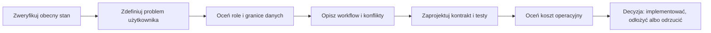

# Analiza rozwoju produktu

## Cel

Ten katalog jest roboczym miejscem do analizy dalszego rozwoju `dotnet-react-starter`.
Nie zastępuje etapów V1-V8 i nie nadaje funkcjom statusu `planned` tylko dlatego, że
pojawiły się na liście. Każda funkcja pozostaje kandydatem do czasu opisania problemu,
dowodów, zakresu, ryzyka i kryteriów akceptacji.

Dokumenty mają rozdzielone odpowiedzialności:

- [`PROJECT_FACTS_SNAPSHOT.md`](PROJECT_FACTS_SNAPSHOT.md) opisuje fakty zastane;
- [`DEVELOPMENT_PLAN.md`](DEVELOPMENT_PLAN.md) ustala rekomendowaną kolejność;
- [`FEATURE_BACKLOG.md`](FEATURE_BACKLOG.md) przechowuje kandydatów;
- [`FEATURE_PROPOSAL_TEMPLATE.md`](FEATURE_PROPOSAL_TEMPLATE.md) służy do podjęcia
  decyzji o jednym feature;
- kanoniczna [`roadmapa V1-V8`](../ROADMAP/00_ROADMAP_OVERVIEW.md) opisuje poziomy
  dojrzałości całego startera.

Główny kierunek analizy to **production-grade full-stack application** z:

- workflowami zależnymi od roli i uprawnień;
- trwałymi powiadomieniami oraz opcjonalną dostawą real-time;
- automatycznymi testami API, PostgreSQL i browser E2E;
- optimistic concurrency bez cichego nadpisywania zmian;
- obserwowalnością, retry, idempotencją i kontrolowanym wdrażaniem tam, gdzie są
  uzasadnione konkretnym przypadkiem użycia.

## Stan potwierdzony na 2026-09-21

| Obszar | Obecny fundament | Najważniejsza luka analityczna |
| --- | --- | --- |
| Role i workflowy | Systemowe role `User`/`Admin` oraz projektowe role `Owner`/`Member`/`Viewer`; backend pozostaje źródłem autoryzacji. | Czy obecny model projektu wystarcza, czy potrzebna jest jawna granica workspace i bardziej szczegółowa macierz uprawnień? |
| Powiadomienia | Trwałe powiadomienia, unread/read, preferencja email i email outbox są już częścią aplikacji. | Brak potwierdzonego transportu push real-time; trzeba najpierw zdefiniować kontrakt zdarzenia, reconnect i odtwarzanie zaległych danych. |
| Współbieżność | `ConcurrencyStamp` chroni wybrane agregaty i konflikty są mapowane na `409 Conflict`; istnieją testy PostgreSQL. | Czy frontend pokazuje użytkownikowi konflikt i pozwala bezpiecznie odświeżyć lub połączyć zmiany w każdym krytycznym workflowie? |
| Testowanie | Są testy jednostkowe, integracyjne, PostgreSQL/Testcontainers i .NET smoke/E2E; konfiguracja Playwright istnieje. | Brakuje pełnej, stabilnej macierzy browser E2E dla najważniejszych przepływów dwóch lub większej liczby użytkowników. |
| Operacje | Docker Compose, health checks, workery, logowanie i dokumentacja deploymentu są obecne. | Brakuje pełnego dowodu staging/production dla storage, backupu, restore, rollbacku i obserwowalności. |

Ten snapshot jest punktem startowym do analizy, a nie nowym raportem release readiness.
Przed rozpoczęciem implementacji należy ponownie zweryfikować odpowiedni fragment kodu,
ponieważ statusy w katalogu są aktualizowane niezależnie od tego pliku.

## Jak korzystać z katalogu

1. Zacznij od [`DEVELOPMENT_PLAN.md`](DEVELOPMENT_PLAN.md), aby poznać aktualną
   kolejność i zależności.
2. W [`FEATURE_BACKLOG.md`](FEATURE_BACKLOG.md) wybierz jeden problem, nie kilka technologii.
3. Skopiuj [`FEATURE_PROPOSAL_TEMPLATE.md`](FEATURE_PROPOSAL_TEMPLATE.md) do osobnego pliku
   o nazwie `CAP-xxx-nazwa.md`.
4. Opisz aktorów, uprawnienia, stany, granice agregatów, konflikt concurrency, kontrakt API,
   testy, obserwowalność i rollback.
5. Porównaj propozycję z odpowiednim etapem w [`../ROADMAP/00_ROADMAP_OVERVIEW.md`](../ROADMAP/00_ROADMAP_OVERVIEW.md)
   oraz istniejącymi ADR-ami.
6. Dopiero po zaakceptowaniu zakresu utwórz plan implementacji i osobny branch dla jednego
   spójnego tematu.

## Rekomendowany porządek analizy

Nie trzeba czekać na wszystkie dowody środowiskowe V5, aby rozwijać lokalne funkcje.
Należy jednak domknąć bramkę bezpośrednio związaną z danym slice'em: kontrakt,
autoryzację, transakcję, test albo operacyjny failure path. Dowody staging, backup,
restore i rollback mogą być zbierane równolegle, ale nadal blokują deklarację
production-ready.

## Kryterium gotowości analizy

Propozycja może przejść do implementacji dopiero, gdy można odpowiedzieć na pytania:

- Jaki konkretny problem użytkownika lub operatora rozwiązujemy?
- Który aktor może wykonać każdą zmianę i na jakiej podstawie?
- Jaki jest stan początkowy, dozwolone przejścia i stan po błędzie?
- Co dzieje się przy dwóch równoległych zapisach?
- Czy powiadomienie jest częścią atomowej zmiany, czy tylko skutkiem dostarczanym później?
- Jak odtworzyć stan po reconnect, retry, timeout albo restarcie procesu?
- Jaki test najtaniej wykryje regresję?
- Jak zmierzyć wartość funkcji i koszt jej utrzymania?
- Jaki jest prostszy wariant i dlaczego nie wystarcza?

## Powiązane źródła

- [`../ROADMAP/00_ROADMAP_OVERVIEW.md`](../ROADMAP/00_ROADMAP_OVERVIEW.md) - kanoniczna kolejność etapów.
- [`../ROADMAP/03_V3_DOMAIN_TRANSACTIONS_AND_CONCURRENCY.md`](../ROADMAP/03_V3_DOMAIN_TRANSACTIONS_AND_CONCURRENCY.md) - granice domeny i concurrency.
- [`../ROADMAP/04_V4_PRODUCT_COMPLETENESS.md`](../ROADMAP/04_V4_PRODUCT_COMPLETENESS.md) - obecne braki produktowe i browser E2E.
- [`../ROADMAP/06_V6_PERFORMANCE_AND_RELIABILITY.md`](../ROADMAP/06_V6_PERFORMANCE_AND_RELIABILITY.md) - pomiary, retry i idempotencja.
- [`../ROADMAP/07_V7_OPTIONAL_EVOLUTION.md`](../ROADMAP/07_V7_OPTIONAL_EVOLUTION.md) - kierunki zależne od realnej potrzeby.
- [`../ROADMAP/14_ADR_INCREMENTAL_MEDIATR_ADOPTION.md`](../ROADMAP/14_ADR_INCREMENTAL_MEDIATR_ADOPTION.md) - zaakceptowany standard dispatchingu command/query i kolejność migracji.
- [`../ARCHITECTURE.md`](../ARCHITECTURE.md) - aktualne granice techniczne i przepływy.
