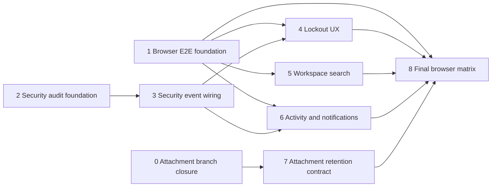

# V4 implementation plan

## Purpose

This document turns the V4 product-completeness roadmap into an executable sequence of
small changes. It is a delivery plan, not a replacement for
`04_V4_PRODUCT_COMPLETENESS.md` or the module checklist.

The sequence optimizes for short feedback loops:

- one coherent hardening topic or feature per branch;
- backend contract and authorization before frontend integration;
- focused tests in the same branch as the behavior;
- a small browser E2E foundation early, then one browser scenario with each workflow;
- no production adapter before the deployment target and threat model are selected.

## Verified baseline

State verified from the worktree on **2026-08-31**:

- account lockout, rate limiting and neutral authentication failures exist in the backend;
- the login page has neutral `401` guidance and a dedicated `429` message;
- quick search searches navigation and actions only;
- there is no authorized workspace-data search endpoint;
- account security events are not stored as a separate durable audit stream;
- product activity and notifications exist, including activity for task comments and
  attachment creation/deletion;
- attachment content inspection, safe storage keys, failed-write cleanup and a durable
  delete-cleanup queue exist;
- configurable per-task attachment count and byte quotas are present in the current
  attachment-hardening worktree, including PostgreSQL serialization with `FOR UPDATE`;
- .NET smoke tests verify the deployed HTTP stack, but no real browser automation exists;
- Docker Compose already provides PostgreSQL, the application and Mailpit, so browser
  authentication tests do not need a fake production email provider.

Before starting a later package, recheck this baseline. A package that has already been
completed should be verified and skipped rather than implemented again.

## Scope boundary

### V4 core

V4 core can be completed without selecting a cloud provider:

- durable account security audit and an authorized audit read model;
- neutral lockout and rate-limit UX;
- authorized workspace search for projects and tasks;
- complete product activity and notification rules for critical collaboration events;
- local attachment invariants, atomic quotas, retention contract and operational signals;
- browser E2E for critical user workflows against Docker Compose.

### V4/V5 closure

The following items require the V5 deployment target and are not guessed in advance:

- the production object-storage adapter;
- backup and restore of production attachment binaries;
- malware scanning or quarantine required by the environment threat model;
- production retention schedules and alerts.

V4 defines and tests the ports, lifecycle rules and local behavior. V5 selects the
provider and proves replacement survival, backup, restore and monitoring. V4 must not be
reported as fully production-ready until that V5 closure is complete.

## Delivery sequence

### Package 0: close the current attachment-hardening branch

Suggested existing branch: `feature/v3-attachment-hardening`.

Goal: finish the work already present without widening it into production storage.

Checklist:

- validate positive and internally consistent values for `MaxFileSizeBytes`,
  `MaxCountPerTask` and `MaxBytesPerTask` at startup;
- preserve the PostgreSQL row-lock transaction around quota calculation and metadata
  creation;
- verify exact count and byte boundaries;
- add a concurrent byte-quota test, complementing the concurrent count-quota test;
- verify that quota rejection removes the binary already written by the handler;
- verify the stable API status and problem response for quota rejection;
- update `12_ATTACHMENT_HARDENING_PLAN.md` only after the focused tests pass.

Exit gate:

- attachment unit tests pass;
- attachment API integration tests pass;
- PostgreSQL quota and cleanup tests pass;
- backend Release build passes.

### Package 1: browser E2E foundation and first auth journey

Suggested branch: `test/v4-browser-e2e-foundation`.

Goal: create the test harness before V4 features accumulate, without moving existing
.NET smoke tests.

Implementation decisions:

- use Playwright for browser automation because the frontend already uses Node and the
  tests need browser contexts, downloads and multi-user scenarios;
- place browser tests under `frontend/e2e/` and keep `backend/E2ETests` for deployed HTTP
  smoke tests;
- add `@playwright/test` as a development dependency and scripts for headless local and
  CI execution;
- run against the Docker Compose frontend and Mailpit HTTP API;
- generate a unique email per test run and poll Mailpit with a bounded timeout;
- do not expose confirmation, reset or 2FA secrets through a new application endpoint;
- retain traces and screenshots only on failure and never log passwords or raw tokens.

First scenario:

1. Register a unique user in the browser.
2. Read the confirmation message from Mailpit and open its link.
3. Log in and obtain the email 2FA message when the runtime policy enables it.
4. Complete 2FA and verify the authenticated dashboard.
5. Log out and verify access is removed.

Exit gate:

- the existing smoke tests still pass;
- the first browser journey passes twice consecutively against a clean Compose stack;
- failure artifacts are useful and contain no credentials.

### Package 2: account security audit foundation

Suggested branch: `feature/v4-account-security-audit-foundation`.

Goal: establish a separate, append-only security boundary before wiring every auth flow.

Recommended model:

- `AccountSecurityEvent` is separate from `ProjectActivity` and `Notification`;
- actor and subject identifiers are nullable because anonymous failures may have no known
  account;
- persist event type, outcome, occurrence time, correlation ID and allowlisted metadata;
- do not persist passwords, raw tokens, 2FA codes, recovery codes, secrets, email message
  bodies or signed URLs;
- treat IP address and user agent as personal data with explicit length and retention
  rules if they are retained at all;
- create events only through an application port such as
  `IAccountSecurityAuditWriter`, not directly from controllers through
  `ApplicationDbContext`;
- use stable string event codes rather than database enum ordinals so new codes do not
  reinterpret old rows;
- make the write append-only in application code; correction means a new event.

Initial event codes:

```text
auth.login.succeeded
auth.login.failed
auth.login.locked
auth.logout.succeeded
auth.refresh.replay-detected
auth.password.changed
auth.password.reset
auth.2fa.email.enabled
auth.2fa.email.disabled
auth.2fa.totp.enabled
auth.2fa.totp.disabled
auth.2fa.recovery-code.used
account.role.changed
account.status.changed
```

Add an admin-only paginated read slice after the write model is established. Filters
should be bounded to event type, outcome, subject, correlation ID and date range. No
public endpoint may reveal whether an email address has an account.

Exit gate:

- migration and model configuration tests pass;
- writer tests prove secret redaction and maximum metadata lengths;
- admin authorization and pagination integration tests pass;
- module registration and direct-`DbContext` guardrails pass.

### Package 3: wire security events into account workflows

Split this package if review becomes too broad:

- `feature/v4-security-audit-session-events` for login, logout, refresh and replay;
- `feature/v4-security-audit-credential-events` for password, 2FA and recovery codes;
- `feature/v4-security-audit-admin-events` for role and account-status changes.

Rules:

- record the final outcome, not merely the start of an operation;
- preserve neutral public auth responses;
- use correlation ID to connect API logs and the durable event;
- define explicitly whether audit persistence failure is fail-open or fail-closed. For
  this starter, use fail-open authentication plus an error log and metric; document that
  regulated environments may require a fail-closed policy;
- keep an audit event and a user-facing security notification separate. A password or
  2FA change can produce both, but each has a different purpose and retention policy.

Required tests:

- success and failure events contain no submitted credential;
- unknown-email login does not create a subject identifier or leak account existence;
- refresh replay creates exactly one replay event for the handled request;
- password and 2FA events are written only after successful state changes;
- role/status changes identify the administrator actor and affected subject.

### Package 4: lockout and rate-limit UX closure

Suggested branch: `feature/v4-auth-lockout-ux`.

Goal: make retry guidance useful without weakening account-enumeration protection.

Decisions:

- keep the same neutral `401` response for unknown account, wrong password and account
  lockout;
- do not implement a browser-local failed-attempt counter because it is incorrect across
  devices, sessions and concurrent requests;
- use a clear neutral message that mentions invalid credentials, temporary blocking and
  password reset without claiming that the account exists;
- for endpoint rate limiting (`429`), honor `Retry-After` when available and disable only
  repeated submission for that bounded period;
- keep the password-reset link available;
- add accessibility coverage for error announcement and disabled/loading state.

Browser scenario: repeated invalid login remains neutral, `429` shows retry guidance and
a later valid login succeeds after the policy window.

### Package 5: authorized workspace search

Use two independently valid branches:

- `feature/v4-workspace-search-api`;
- `feature/v4-workspace-search-ui`.

Backend MVP contract:

```http
GET /api/workspace/search?query=invoice&type=projectTask&page=1&pageSize=10
```

Start with one result type, `projectTask`, as required by the roadmap. Add `project` in a
small follow-up after the contract and authorization tests are stable. Members,
invitations and notifications remain optional until a demonstrated product need exists.

Backend rules:

- require authentication;
- normalize and validate a query length of 2-100 characters;
- cap `pageSize` at 20 and return a typed paginated response;
- filter in SQL to active projects where the current user is owner or active member;
- return only navigation-safe fields: result type, resource ID, project ID, title and a
  short display context;
- do not fetch all data and filter in memory;
- use a dedicated `SearchWorkspace` query slice and focused read port;
- defer external search engines, PostgreSQL full-text search and new indexes until query
  plans or data volume justify them.

Authorization tests must prove that an exact matching title, result count and pagination
metadata do not reveal tasks from inaccessible or archived projects.

Frontend rules:

- preserve static page/action suggestions and display workspace data in a separate group;
- debounce requests, cancel stale requests and ignore out-of-order responses;
- provide loading, empty, minimum-query and recoverable-error states;
- use the result discriminator to build routes; do not infer authorization in the UI;
- cover keyboard navigation, focus return and screen-reader labels.

Browser scenario: an authorized task is found and opened, while an exact title from
another user's project returns no result.

### Package 6: product activity and notification completeness

Use one planning branch followed by small implementation branches:

- `docs/v4-product-event-matrix`;
- `feature/v4-collaboration-notifications`;
- `feature/v4-notification-deduplication`.

Create a checked-in event matrix with these columns:

```text
Trigger | Product activity | Recipient notification | Security audit |
Atomic with state change | Resource link | Deduplication key | Tests
```

Audit the existing behavior before adding events. The current code already records
comment and attachment activity, so these are verification targets rather than assumed
gaps.

Minimum critical map:

- project create/archive;
- invitation create/accept/decline/expire;
- member add/remove/role change;
- task create/update/status change/delete/assignment;
- comment add;
- attachment add/delete;
- deadline approaching/overdue.

Rules:

- product activity answers "what changed in this project";
- notification answers "which user must be informed";
- security audit answers "what security-relevant account action occurred";
- do not notify the actor about their own collaboration action unless it is a security
  confirmation;
- state change, activity, notification and email outbox records that must agree are
  staged before one `SaveChangesAsync`;
- add a stable deduplication key and database uniqueness constraint for retryable
  notification producers before enabling retries;
- standardize `ResourceType`, `ResourceId` and `ProjectId` so every notification can
  build a valid authorized route.

Exit gate:

- every row in the critical event matrix has an implementation or an explicit
  "not applicable" decision;
- partial-failure and duplicate-delivery tests pass on PostgreSQL where relevant;
- notification links work in a browser scenario for invitation, assignment and one
  comment or attachment event.

### Package 7: attachment retention and production-storage contract

Suggested branches:

- `feature/v4-attachment-retention`;
- `docs/v4-attachment-operations-contract`.

Implement provider-neutral behavior:

- explicit retention rules for active metadata, rejected uploads and cleanup messages;
- idempotent bounded cleanup batches with cancellation;
- attempt count, next-attempt time, last safe error code and terminal-failure handling;
- health and metrics for cleanup backlog, oldest message age and failures;
- orphan reconciliation contract in both directions: metadata without binary and binary
  without metadata;
- startup failure in Production when local storage lacks an explicit persistent path.

Do not add quarantine states until scanning is selected. Do not add an object-storage SDK
until V5 selects the deployment target. At that point implement one adapter behind the
existing storage port and add restart, backup and restore tests.

Browser scenario: upload, download and delete an attachment; verify viewer/outsider
authorization and a user-visible quota error.

### Package 8: final browser matrix and V4 release gate

Suggested branch: `test/v4-critical-browser-workflows`.

Complete only the scenarios that were not added with earlier packages:

- registration, email confirmation, login and logout;
- login with email 2FA and TOTP/recovery code where the UI supports them;
- password reset through Mailpit;
- create a project;
- invite and accept a member using two isolated browser contexts;
- create, edit and change task status;
- add a comment and attachment;
- deny access to another user's resource;
- surface an optimistic concurrency conflict without silently overwriting data.

Keep setup through public APIs only when it does not bypass the behavior under test.
Use browser interaction for the critical assertions. Run destructive or timing-sensitive
scenarios with unique data so tests can execute independently.

## Dependency map



Packages 2 and 5 can proceed independently after Package 1. Package 7 can proceed after
Package 0. Keep one active feature branch at a time unless work is intentionally assigned
to separate developers.

## Validation matrix

| Change type | Minimum validation |
|---|---|
| Domain invariant or handler | Focused unit tests and backend Release build |
| Public API or authorization | API integration tests including anonymous and forbidden cases |
| Transaction, constraint or deduplication | Focused PostgreSQL integration tests |
| Frontend contract or state | Focused Vitest tests and frontend build |
| User workflow | Playwright scenario against Docker Compose |
| Storage or retention | Failure, retry, restart and reconciliation tests |
| Roadmap status | Evidence link plus recalculated percentage after the branch gate passes |

At the end of each implementation branch, run only the focused tests first. Then run the
relevant project build and broader affected suite. Run the full backend, frontend and
browser release gate before marking V4 core complete.

## Completion evidence

Use this checklist when updating the V4 percentages:

- [ ] Security audit has durable writes, safe metadata, authorized reads and critical
      event coverage.
- [ ] Lockout and rate-limit UX is neutral, accessible and browser-tested.
- [ ] Workspace search has server-side authorization, pagination and project/task UI.
- [ ] Attachment local invariants, quotas, retention and recovery contract are tested.
- [ ] The chosen V5 production storage and recovery procedure close the deployment gap.
- [ ] The critical product event matrix is complete and retryable notifications dedupe.
- [ ] Every critical workflow has one passing browser path and important denial paths.
- [ ] Backend and frontend Release builds and all affected tests pass.
- [ ] Architecture, privacy, retention and operations documentation matches the code.

## Fast start for the next sessions

For each package, begin with the named anchor and one failing or missing test:

| Package | First anchor | First discriminating check |
|---|---|---|
| 0 | `EfCreateProjectTaskAttachmentStore` | Concurrent byte quota leaves exactly one valid row |
| 1 | `frontend/package.json` and Mailpit | Register-confirm-login works twice on Compose |
| 2 | `ApplicationDbContext` auth entities | Persisted event contains no submitted secret |
| 3 | `AuthController` and `DatabaseAuthService` | Final auth outcome maps to exactly one event |
| 4 | `Login.tsx` | `401` stays neutral and `429` has bounded retry UX |
| 5 | `QuickSearchBar.tsx` and task access query | Inaccessible exact match produces zero results |
| 6 | product event matrix and existing writers | State plus required side effects commit atomically |
| 7 | attachment cleanup processor and storage port | Repeated cleanup is safe and observable |
| 8 | Playwright auth fixture | Two browser contexts complete invitation workflow |

This table is the handoff point for implementation. It avoids repeating a repository-wide
audit at the start of every branch while still requiring a local code check before edits.